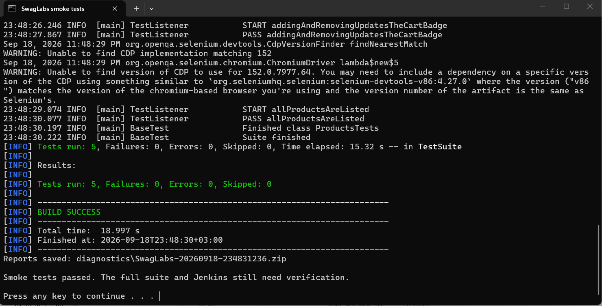

# Swag Labs Final Project

Java 17 UI automation framework for the complete SauceDemo purchase journey. It uses Selenium, TestNG, Allure, Page Objects, thread-local drivers, data-driven tests, automatic retry, and failure screenshots.

## Run

Requirements: Java 17, Maven, and Google Chrome.

On Windows, extract the project and double-click **RUN-SMOKE.cmd**. Enter the public demo password shown on [SauceDemo](https://www.saucedemo.com/) when prompted. The runner executes the five smoke tests in headless Chrome, preserves previous reports and saves diagnostic ZIPs in `diagnostics/`.

PowerShell, from the folder containing `pom.xml`:

```powershell
$env:SAUCE_PASSWORD = Read-Host 'SauceDemo demo password'
mvn clean test "-Dheadless=true" "-DsuiteXmlFile=testng-smoke.xml"
```

Bash:

```bash
SAUCE_PASSWORD="<SauceDemo test password>" mvn test
SAUCE_PASSWORD="<SauceDemo test password>" mvn test -Dheadless=true
SAUCE_PASSWORD="<SauceDemo test password>" mvn test -DsuiteXmlFile=testng-smoke.xml -Dheadless=true
SAUCE_PASSWORD="<SauceDemo test password>" mvn test -DsuiteXmlFile=testng-parallel.xml -Dheadless=true
mvn test -Dbase.url=https://www.saucedemo.com/ -Dtimeout=30
mvn allure:serve
```

The full suite contains 20 test methods. Configuration lives in `src/test/resources/config.properties`; matching `-D` system properties override file values. The SauceDemo password is supplied through the `SAUCE_PASSWORD` environment variable and is intentionally not committed to the repository.

## CI

The Jenkins pipeline accepts `SUITE` and `HEADLESS`, then checks out, builds, tests, and always publishes JUnit, Allure results, and screenshots.

## What I would automate next

I would add browser-matrix execution, accessibility checks, visual regression for the checkout summary, API-assisted test-data setup, and Dockerized Selenium Grid execution.

## Verification status

The repaired project passed all five smoke tests on Windows on 2026-09-18: 0 failures, 0 errors, 0 skipped and BUILD SUCCESS, confirmed by the user's console screenshot. Java 17 compilation and four browser-free framework regression checks also passed. Full-suite, parallel-suite, Allure report and Jenkins verification remain pending; see [VERIFICATION.md](VERIFICATION.md) for the evidence and limits. Configure Jenkins tools named `JDK17` and `Maven3`, install the Allure plugin and its command-line tool, and make Chrome available on the agent. Data providers produce 28 test invocations from the 20 UI methods; four separate framework checks run without a browser.



See [RUN-AND-SUBMIT.md](RUN-AND-SUBMIT.md) for Windows/Unix Jenkins setup and Git upload steps, and [VERIFICATION.md](VERIFICATION.md) for the actual verification status.
